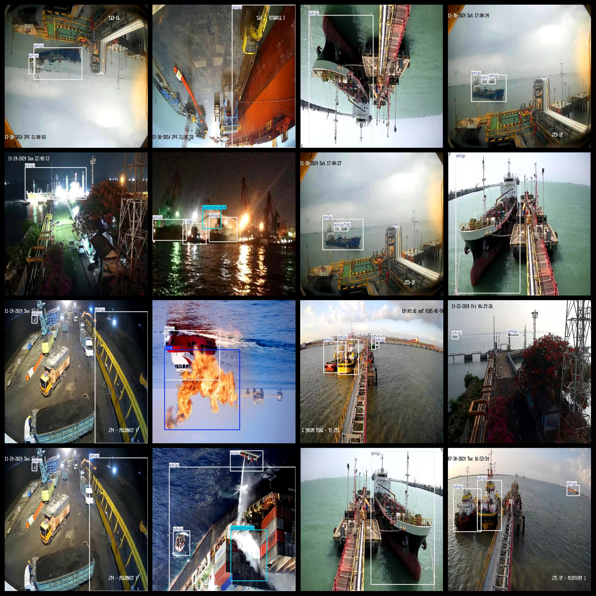

# Ship Smoke and Fire Smoke Detection Dataset 2853 imagesVOC+YOLO format

Ship fireworks smoke detection dataset 2853 VOC + YOLO format

Dataset format: Pascal VOC format + YOLO format (the txt file does not contain the split path, it only contains jpg images and corresponding VOC format xml files and yolo format txt files)

Number of Images: 2853

Number of XML files: 2853

Number of annotations (number of txt files): 2853

Number of annotated categories: 3

The Github repository is: datasets_sl

["fire", "gassmoke", "ship"]

Label Controls: Fire, Smoke, Ship

Number of boxes labeled in each category:

Fire Frame Count = 551

【"Gassmoke" Frame Count = 878】

Ship Frame Count = 5555

Total frame count: 6984

Number of images per category:

Fire has 452 pictures.

Gassmoke has 778 images.

Ship occupies 2843 images.

Image resolution: 640x640

Use the labeling tool: labelImg

Dataset Augmentation: Yes

Rules for annotation: Draw a rectangle around the category.

Important note: The dataset does not have been divided into training, validation, and testing sets.

Special Disclaimer: This dataset does not guarantee the accuracy of the trained models or weight files.

Annotation and image details are as follows:

## Images

---

Here is a pay link on Stripe (https://buy.stripe.com/3cs8yP7sY87d0vu9AB). Please contact me lonlonago@foxmail.com after funding $89, and I will send you a complete data files, thank you!

